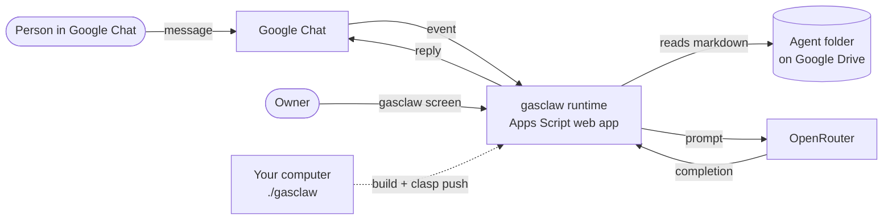

# gasclaw

**AI agents that live entirely inside Google Apps Script. No server, no hosting: an agent is a Google Drive folder, and you talk to it in Google Chat.**

[](LICENSE)
[](https://developers.google.com/apps-script)
[](https://www.typescriptlang.org/)
[](CHANGELOG.md)

English | [Português (Brasil)](README.pt-BR.md)

## Why gasclaw

- **Nothing to host.** The runtime runs in your own Google Workspace account on Apps Script. Your computer only compiles TypeScript and publishes with clasp.
- **Agents are documents, not code.** Each agent is a Drive folder of markdown files (rules, personality, identity, user notes). Edit a file and the next message uses it, with no redeploy.
- **Where your team already talks.** Conversations happen in Google Chat, in a DM or in a space.
- **Any model.** The LLM is reached through OpenRouter, so an agent switches models by changing one line.
- **Safe by construction.** gasclaw never executes code read from Drive, only the owner can manage it, and access is allow-listed per agent.

## How it works



1. A message arrives from Google Chat. gasclaw checks the kill switch and whether the sender may talk to the agent.
2. It reads the agent's folder and builds the prompt from the markdown files.
3. It calls the model through OpenRouter and replies in the same conversation, keeping a short recent history.

Design details: [design spec](docs/specs/2026-09-14-gasclaw-design.md) and [architecture decisions](docs/adr/README.md).

## Status

**gasclaw is in stage F0 and is not ready for production.** The F0 code is written and passes its tests, but it has **not yet been published to Google**, so it cannot be used for real yet. The first publication is in progress. See [CHANGELOG.md](CHANGELOG.md) for exactly what works, what is under construction, and what is planned.

## Quickstart

Requirements: macOS with [Homebrew](https://brew.sh), Node.js 22.12+ (or 24+), a Google Workspace account, and an [OpenRouter](https://openrouter.ai) API key.

```bash
npm ci
echo 'OPENROUTER_API_KEY=sk-or-...' > .env.local   # never commit this file
./gasclaw up
```

On the first run, `./gasclaw up` installs missing tools, creates the Google Cloud project and the Apps Script project, and publishes. For the few steps that can only be done by clicking, it pauses, opens the right page, and waits for Enter. Each completed step is recorded, so running it again does not repeat anything.

Step-by-step guide (pt-BR): [docs/como-usar.md](docs/como-usar.md). Stuck? Run `./gasclaw doctor` and see the [initial setup runbook](docs/runbooks/setup-inicial.md).

## Create your first agent

Create an empty Drive folder (for example "Assistant") and add its URL on the gasclaw screen (`./gasclaw open`). gasclaw creates these files from templates and **never overwrites** a file that already exists:

```
Assistant/
├── AGENTS.md     rules; the frontmatter is the agent's configuration
├── SOUL.md       personality and tone
├── IDENTITY.md   name and emoji
└── USER.md       who the agent serves
```

All files go into the prompt in this order. A missing file becomes `(missing)` instead of an error.

`AGENTS.md` example:

```markdown
---
model: openrouter/auto        # any OpenRouter model id
users: [ana@example.com, joao@example.com]
---
# Rules
- Answer briefly and directly.
- If you don't know, say so.
```

Supported frontmatter in F0:

- `model:` an OpenRouter model id. Defaults to `openrouter/auto`.
- `users: [email, email]` on a single line. The owner always has access; an empty list means owner only.
- Other keys are ignored in this stage, and nested keys are not supported.

Then find the app in Google Chat (`gasclaw dev`, or `gasclaw` in prod), send a DM, or add it to a space and mention it.

## CLI reference

Every command accepts `--prod`; without it, the command targets dev.

| Command | What it does |
|---|---|
| `./gasclaw up [--prod]` | Sets up (first time), publishes, and opens the gasclaw screen |
| `./gasclaw down [--prod]` | Pauses all agents (kill switch) |
| `./gasclaw restart [--prod]` | `down` followed by `up` |
| `./gasclaw ship` | Publishes to prod at the same URL |
| `./gasclaw logs [--prod]` | Streams live logs |
| `./gasclaw status [--prod]` | Shows IDs, URLs, deployments, and health |
| `./gasclaw doctor [--prod]` | Diagnoses the setup and tells you how to fix it |
| `./gasclaw rollback [--prod]` | Returns to the previous version |
| `./gasclaw open [--prod]` | Opens the gasclaw screen |

## Roadmap

| Stage | Goal | Status |
|---|---|---|
| F0 | First conversation with a Drive agent: one-command publish, agent folder, owner screen, Google Chat replies, per-agent access, kill switch | In progress |
| F1 | Complete agent folder: conversations stored in Drive, daily memory, first-run ritual, skills, multiple agents, Google Groups in `users`, safer publishing | Planned |
| F2 | Long tasks and approval: background work beyond 30 s, Gmail/Drive/Sheets/Docs/Calendar/HTTP tools, Approve/Deny cards, per-task limits, retries | Planned |
| F3 | Proactivity and data: `HEARTBEAT.md` checklist, cron-style `jobs.md`, `.xlsx` inbox to Google Sheets, ready-made agent templates | Planned |
| F4 | Extra channels: Gmail threads, HTTP with token, MCP/A2A if the GASADK proof of concept passes, `npx gasclaw` | Planned |

The detailed, user-facing description of each stage is in [CHANGELOG.md](CHANGELOG.md).

## Known limitations

Current F0 limits:

- Chat only: no e-mail, spreadsheets, or scheduling yet (tools arrive in F2).
- Only **one** agent (the default one) answers in Chat, in every space.
- Short memory: the last 20 messages per agent and conversation, for up to 6 hours.
- Each agent file is truncated at 20,000 characters (60,000 in total).
- Replies are capped at 1,000 tokens because Google Chat waits at most 30 seconds; a slow model means Chat reports that the app did not respond.
- `users` accepts e-mail addresses only, not groups.
- No automatic retry when OpenRouter fails (429/5xx).
- The `./gasclaw` CLI currently targets macOS (it uses Homebrew, `open`, and `pbcopy`).
- Built for Google Workspace accounts (internal OAuth consent, domain-scoped Chat app).

## Security

- Secrets live only in `.env.local` (git-ignored) and in the owner-only gasclaw screen, stored in Script Properties. Never in Drive or in git.
- No `eval` and no code loaded from Drive: an agent is markdown only.
- Only the owner (the account that published) can open the gasclaw screen; each agent answers only the owner and the addresses in `users`.
- `./gasclaw down` or "Pause" on the screen stops every agent immediately.

**Found a vulnerability?** Please do not open a public issue. E-mail **gabriel.br@gmail.com**; details in [CONTRIBUTING.md](CONTRIBUTING.md#reporting-security-vulnerabilities).

## Contributing

Contributions are welcome. Read [CONTRIBUTING.md](CONTRIBUTING.md) for setup (`npm ci`, `npm run build`, `npm test`), project rules, the test-first workflow, and the pull request checklist. Commits follow Conventional Commits and require a DCO sign-off (`git commit -s`). This project follows the [Code of Conduct](CODE_OF_CONDUCT.md).

Project documentation (in pt-BR) is indexed at [docs/README.md](docs/README.md).

## License

Licensed under the [Apache License, Version 2.0](LICENSE). Copyright 2026 Gabriel Sorrentino. See [NOTICE](NOTICE) and [LICENSING.md](LICENSING.md) for contributions, dependency licenses, and trademarks.

Google, Google Apps Script, Google Drive, and Google Chat are trademarks of Google LLC; OpenRouter belongs to its owner. gasclaw is not affiliated with or endorsed by them.

## Acknowledgements

gasclaw borrows ideas (not code dependencies) from:

- [vercel/eve](https://github.com/vercel/eve) (Apache-2.0): the folder as the authoring interface, per-tool approval, per-step checkpoints.
- [openclaw/openclaw](https://github.com/openclaw/openclaw) (MIT): workspace files, first-run ritual, heartbeat, daily memory, approval cards in Chat.
- [tanaikech/adk-gas](https://github.com/tanaikech/adk-gas) (MIT): agent planning and timeout/context protection in Apps Script.
- [google/clasp](https://github.com/google/clasp) (Apache-2.0): deploying Apps Script from the command line.

Built with [devmode](https://github.com/fluencer-ai/devmode).
