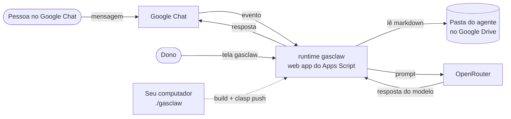

# gasclaw

**Agentes de IA que vivem inteiramente dentro do Google Apps Script. Sem servidor, sem hospedagem: um agente é uma pasta do Google Drive, e você conversa com ele pelo Google Chat.**

[](LICENSE)
[](https://developers.google.com/apps-script)
[](https://www.typescriptlang.org/)
[](CHANGELOG.md)

[English](README.md) | Português (Brasil)

## Por que gasclaw

- **Nada para hospedar.** O runtime roda na sua própria conta do Google Workspace, no Apps Script. Seu computador só compila o TypeScript e publica com o clasp.
- **Agentes são documentos, não código.** Cada agente é uma pasta do Drive com arquivos markdown (regras, personalidade, identidade, notas sobre o usuário). Editou um arquivo? A próxima mensagem já usa a versão nova, sem publicar de novo.
- **Onde seu time já conversa.** As conversas acontecem no Google Chat, em DM ou num espaço.
- **Qualquer modelo.** O LLM vem do OpenRouter, então um agente troca de modelo mudando uma linha.
- **Seguro por construção.** O gasclaw nunca executa código lido do Drive, só o dono consegue administrá-lo e o acesso é liberado por agente.

## Como funciona



1. Chega uma mensagem do Google Chat. O gasclaw confere o botão de pânico e se quem mandou pode falar com o agente.
2. Ele lê a pasta do agente e monta o prompt a partir dos arquivos markdown.
3. Chama o modelo pelo OpenRouter e responde na mesma conversa, guardando um histórico curto das mensagens recentes.

Detalhes do design: [spec de design](docs/specs/2026-09-14-gasclaw-design.md) e [decisões de arquitetura](docs/adr/README.md).

## Status

**O gasclaw está na etapa F0 e não está pronto para produção.** O código da F0 está escrito e passa nos testes, mas **ainda não foi publicado no Google**, então ainda não dá para usar de verdade. A primeira publicação está em andamento. Veja no [CHANGELOG.md](CHANGELOG.md) exatamente o que funciona, o que está em construção e o que está planejado.

## Início rápido

Requisitos: macOS com [Homebrew](https://brew.sh), Node.js 22.12+ (ou 24+), uma conta do Google Workspace e uma chave de API do [OpenRouter](https://openrouter.ai).

```bash
npm ci
echo 'OPENROUTER_API_KEY=sk-or-...' > .env.local   # nunca commite este arquivo
./gasclaw up
```

Na primeira execução, o `./gasclaw up` instala as ferramentas que faltam, cria o projeto do Google Cloud e o projeto do Apps Script e publica. Nos poucos passos que só dão para fazer clicando, ele pausa, abre a página certa e espera você apertar Enter. Cada passo concluído fica registrado, então rodar de novo não repete nada.

Guia passo a passo: [docs/como-usar.md](docs/como-usar.md). Travou? Rode `./gasclaw doctor` e veja o [runbook de setup inicial](docs/runbooks/setup-inicial.md).

## Crie seu primeiro agente

Crie uma pasta vazia no Drive (por exemplo "Assistente") e adicione a URL dela na tela gasclaw (`./gasclaw open`). O gasclaw cria estes arquivos a partir de modelos e **nunca sobrescreve** um arquivo que já exista:

```
Assistente/
├── AGENTS.md     regras; o frontmatter é a configuração do agente
├── SOUL.md       personalidade e tom
├── IDENTITY.md   nome e emoji
└── USER.md       quem o agente atende
```

Todos os arquivos entram no prompt nesta ordem. Um arquivo que falte vira `(missing)`, em vez de erro.

Exemplo de `AGENTS.md`:

```markdown
---
model: openrouter/auto        # qualquer id de modelo do OpenRouter
users: [ana@exemplo.com, joao@exemplo.com]
---
# Regras
- Responda de forma curta e direta.
- Se não souber, diga que não sabe.
```

Frontmatter aceito na F0:

- `model:` id de modelo do OpenRouter. O padrão é `openrouter/auto`.
- `users: [e-mail, e-mail]` numa linha só. O dono sempre tem acesso; lista vazia significa só o dono.
- Outras chaves são ignoradas nesta etapa, e chaves aninhadas não são aceitas.

Depois, procure o app no Google Chat (`gasclaw dev`, ou `gasclaw` em prod), mande uma DM ou adicione o app a um espaço e mencione-o.

## Referência do CLI

Todos os comandos aceitam `--prod`; sem a flag, valem para dev.

| Comando | O que faz |
|---|---|
| `./gasclaw up [--prod]` | Configura (primeira vez), publica e abre a tela gasclaw |
| `./gasclaw down [--prod]` | Pausa todos os agentes (botão de pânico) |
| `./gasclaw restart [--prod]` | `down` seguido de `up` |
| `./gasclaw ship` | Publica em prod na mesma URL |
| `./gasclaw logs [--prod]` | Mostra os logs ao vivo |
| `./gasclaw status [--prod]` | Mostra IDs, URLs, implantações e health |
| `./gasclaw doctor [--prod]` | Diagnostica o setup e diz como corrigir |
| `./gasclaw rollback [--prod]` | Volta para a versão anterior |
| `./gasclaw open [--prod]` | Abre a tela gasclaw |

## Roadmap

| Etapa | Objetivo | Status |
|---|---|---|
| F0 | Primeira conversa com um agente do Drive: publicação com um comando, pasta do agente, tela do dono, respostas no Google Chat, acesso por agente, botão de pânico | Em andamento |
| F1 | Pasta do agente completa: conversas guardadas no Drive, memória diária, ritual de estreia, skills, vários agentes, grupos do Google em `users`, publicação mais segura | Planejado |
| F2 | Tarefas longas e aprovação: trabalho em segundo plano além de 30 s, ferramentas Gmail/Drive/Sheets/Docs/Agenda/HTTP, cards Aprovar/Negar, limites por tarefa, novas tentativas | Planejado |
| F3 | Proatividade e dados: checklist `HEARTBEAT.md`, `jobs.md` em formato cron, pasta de entrada `.xlsx` para Google Sheets, modelos prontos de agente | Planejado |
| F4 | Canais extras: threads do Gmail, HTTP com token, MCP/A2A se a POC do GASADK aprovar, `npx gasclaw` | Planejado |

A descrição detalhada de cada etapa, do ponto de vista de quem usa, está no [CHANGELOG.md](CHANGELOG.md).

## Limites conhecidos

Limites atuais da F0:

- Só conversa: ainda não envia e-mail, não mexe em planilha e não agenda nada (ferramentas chegam na F2).
- Só **um** agente (o padrão) responde no Chat, em todos os espaços.
- Memória curta: as últimas 20 mensagens por agente e por conversa, por até 6 horas.
- Cada arquivo do agente é cortado em 20.000 caracteres (60.000 no total).
- Respostas limitadas a 1.000 tokens, porque o Google Chat espera no máximo 30 segundos; um modelo lento faz o Chat avisar que o app não respondeu.
- `users` aceita só e-mails, não grupos.
- Sem nova tentativa automática quando o OpenRouter falha (429/5xx).
- O CLI `./gasclaw` hoje é voltado para macOS (usa Homebrew, `open` e `pbcopy`).
- Feito para contas do Google Workspace (consentimento OAuth interno, app do Chat restrito ao domínio).

## Segurança

- Segredos ficam só em `.env.local` (ignorado pelo git) e na tela gasclaw, que só o dono acessa, guardados nas Script Properties. Nunca no Drive nem no git.
- Sem `eval` e sem código carregado do Drive: um agente é só markdown.
- Só o dono (a conta que publicou) abre a tela gasclaw; cada agente responde só ao dono e aos e-mails listados em `users`.
- `./gasclaw down` ou "Pausar" na tela param todos os agentes na hora.

**Encontrou uma vulnerabilidade?** Não abra uma issue pública. Mande um e-mail para **gabriel.br@gmail.com**; detalhes em [CONTRIBUTING.md](CONTRIBUTING.md#reporting-security-vulnerabilities) (em inglês).

## Como contribuir

Contribuições são bem-vindas. Leia o [CONTRIBUTING.md](CONTRIBUTING.md) (em inglês) para o setup (`npm ci`, `npm run build`, `npm test`), as regras do projeto, o fluxo com testes primeiro e o checklist de pull request. Os commits seguem Conventional Commits e exigem sign-off DCO (`git commit -s`). Este projeto segue o [Código de Conduta](CODE_OF_CONDUCT.md).

A documentação do projeto está indexada em [docs/README.md](docs/README.md).

## Licença

Licenciado sob a [Apache License, Version 2.0](LICENSE). Copyright 2026 Gabriel Sorrentino. Veja [NOTICE](NOTICE) e [LICENSING.md](LICENSING.md) para contribuições, licenças das dependências e marcas.

Google, Google Apps Script, Google Drive e Google Chat são marcas da Google LLC; OpenRouter pertence ao seu dono. O gasclaw não é afiliado a eles nem endossado por eles.

## Agradecimentos

O gasclaw aproveita ideias (não dependências de código) de:

- [vercel/eve](https://github.com/vercel/eve) (Apache-2.0): a pasta como interface de autoria, aprovação por ferramenta, checkpoint por passo.
- [openclaw/openclaw](https://github.com/openclaw/openclaw) (MIT): arquivos do workspace, ritual de estreia, heartbeat, memória diária, cards de aprovação no Chat.
- [tanaikech/adk-gas](https://github.com/tanaikech/adk-gas) (MIT): planejamento de agentes e proteção de timeout e contexto no Apps Script.
- [google/clasp](https://github.com/google/clasp) (Apache-2.0): publicar Apps Script pela linha de comando.

Construído com [devmode](https://github.com/fluencer-ai/devmode).
